# Lines of Action

Lines of Action is a board game invented by Claude Soucie, and implemented entirely in Java by myself. This program comes in two versions: a command line interface and a graphical user interface. The most notable feature of this project is the inclusion of an AI agent that operates using the minimax algorithm with alpha-beta pruning and heuristics designed around the rules and objectives of the game in order to make it play as optimally as possible.
## Overview
Played on a checkerboard with ordinary checkers pieces, it is a two player game where each player takes turns moving a piece, with the possibility of capturing an opposing piece. The following is a brief overview of its rules:
- The objective is to get all of one's pieces into one large contiguous group (a group where all pieces are connected). 
- Two pieces are connected if they are adjacent horizontally, vertically, or diagonally. 
- A move consists of moving a piece of your color horizontally, vertically, or diagonally onto an empty square or onto a square occupied by an opposing piece, which is then considered captured.
- A legal move is one where the number of squares is exactly equal to number of pieces (both friendly and enemy) are present along the *line of action* which it chooses to move. This line contains both the squares behind and in front of the piece that moves, as well as the square the piece is on.
- A piece has the ability to jump over friendly pieces, but cannot do so over enemy pieces.
- A piece may not move off the board, onto another piece of its color, or over an opposing piece.

## CLI Version
The command line version operates via text commands. Here is a list of all available commands, alongside a description of their function:
* **dump**: Prints out a text-based view of the current state of the board.   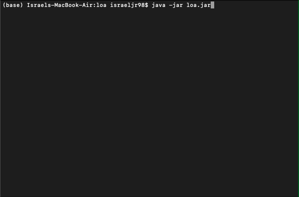
* **c1r1-c2r2**: Denotes a move from square c1r1 to square c2r2, where the square at column ci and row nj is denoted cn. A move chosen by the AI agent is preceded by an asterisk (*).   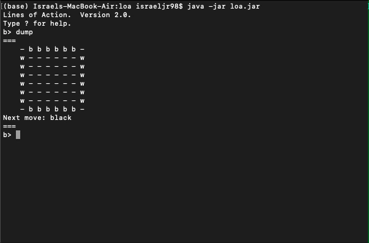
* **manual** *P*: Switches player P to a manual player that responds to moves from the command line on subsequent turns. The value P must be "black" or "white". Initially, black is an automated player.   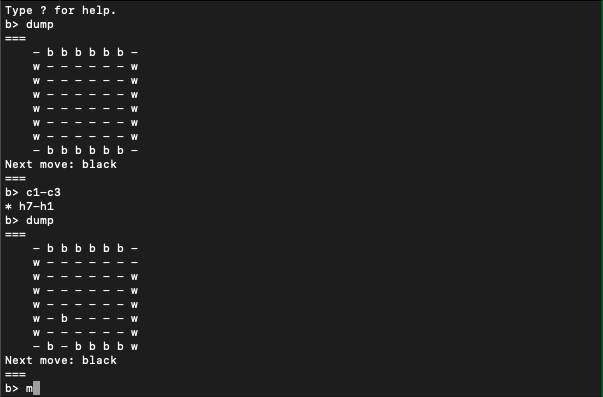
* **auto** *P*: Switches player P to an automated player (an AI agent) on subsequent turns. The value P must be "black" or "white". Initially, white is an automated player. Additionally, this is a good time to mention that this implementation of LOA allows for two automated players to face each other.   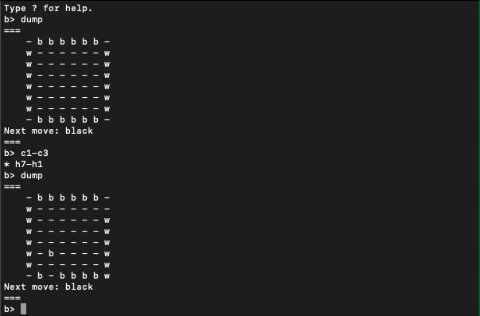
* **new**: Restarts the game by clearing the board and setting the current player to Black.   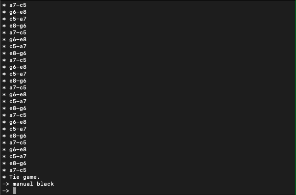
* **help**: Prints a brief summary of the rules.   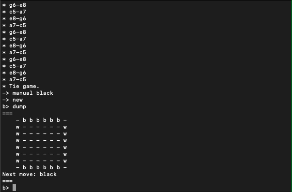
* **quit**: Exits the game.   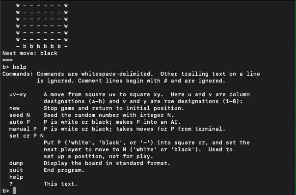

## GUI Version
The GUI version operates via the mouse. In order to invoke it, a `--display` flag must be included when launching the program.   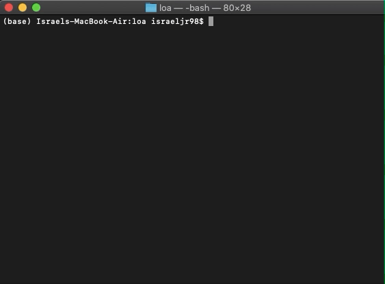  
Here is an overview of how it works:
* **Moves**: A piece is moved by clicking and dragging it along the desired line of action. If a move is not legal, the board will remain unchanged.   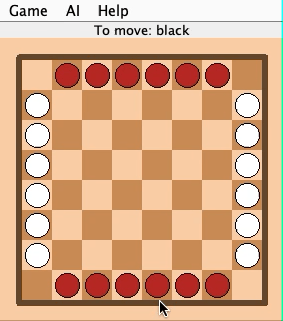
* **Game**: The "Game" menu button houses two options: *New* and *Quit*.
  * **New**: Resets the board to its initial state.   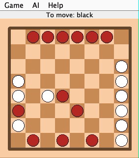
  * **Quit**: Exits the game.   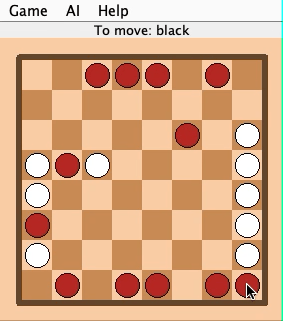
* **AI**: The "AI" menu button allows for toggling between manual and auto modes for both players.
  * Example 1 - Switching Black to AI player.   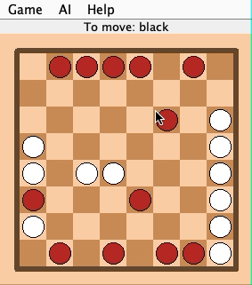
  * Example 2 - Switching White to manual player.   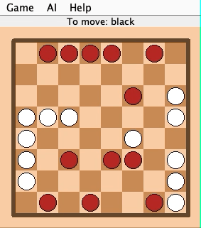
* **Help**: The "Help" menu button provides the player with helpful information pertaining to the game.
  * **About**: Display an about page.   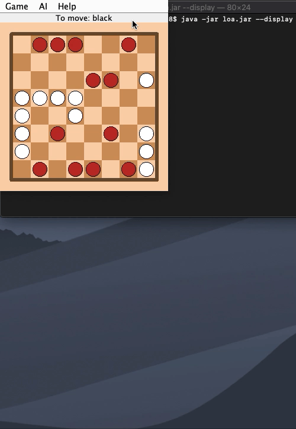
  * **Help**: Displays a page with a summary of the rules.   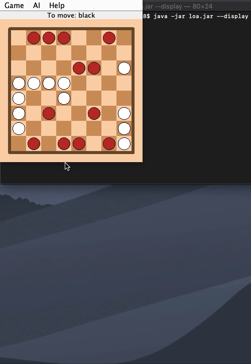
